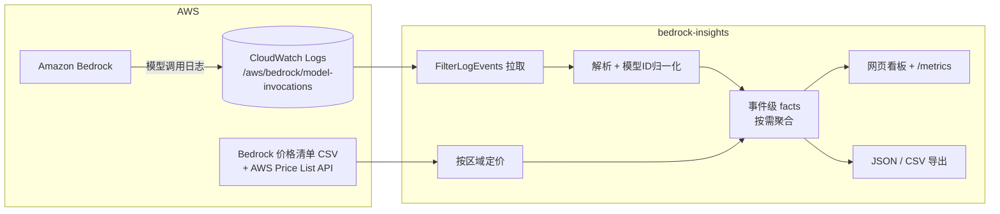
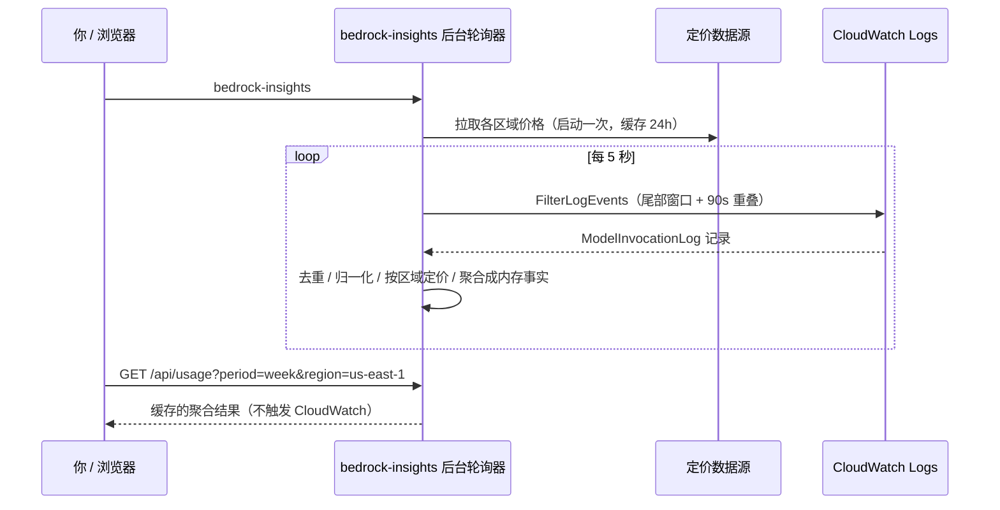

# 实时监控 Amazon Bedrock 的 Token 用量与成本

_作者：<你的名字> | 2026 年 6 月 | 分类：Amazon Bedrock、Amazon CloudWatch、Technical How-to_

设想这样一个场景：你的 Amazon Bedrock Agent 正在生产环境里跑，一个用户的请求触发了几十次模型调用；财务同事问你"这个新功能这周花了多少钱"；或者凌晨成本突然飙升，而你想立刻知道是哪个模型、哪个区域、哪个调用方导致的。这些情况下，等一个跑批任务或第二天的账单都太慢了——你需要**当下**就看清 Bedrock 的花费。

在本文中，你将用一个开源命令行工具 `bedrock-insights`，搭建一套针对 Amazon Bedrock 的实时成本可观测方案：从开启日志、启动一个零依赖的实时网页看板，到接入 Prometheus/Grafana 和 Slack 告警，并支持把数据导出为 JSON/CSV 供自动化使用。你会了解它的架构、动手把它跑起来，并深入理解它是如何分析 Amazon Bedrock 调用日志的。

我们做这个工具，是因为反复遇到同一个痛点：团队在用 Bedrock，但要实时看清成本，要么去 Cost Explorer 等一两天，要么自己写脚本去啃 CloudWatch 里那堆嵌套 JSON。`bedrock-insights` 正好填补中间这段空白——把"现在花了多少钱"变成一条命令。

## 谁适合用这个方案

如果下面的场景听起来像你的日常，那这个方案就适合你。

**生成式 AI 应用与 Agent 开发者**：你在迭代一个会循环调用模型的 Agent，想在每次改完 prompt 或调整流程后，立刻看到 token 用量和成本的变化，而不是第二天才发现某次改动让成本翻倍。

**平台与 FinOps 团队**：你需要把 Bedrock 成本纳入团队已有的监控告警体系（如 Grafana），并按 IAM 身份看清"谁在花钱"，在花费越过预算阈值时第一时间收到 Slack 通知。

**解决方案架构师与技术支持团队**：你在帮客户做 PoC 或排查，想快速、按区域地看清某个账号的 Bedrock 用量分布，而不必为客户搭一套重型监控。

这些场景有一些共同点：对**实时性**有要求（跑批太慢）、关心**按模型/身份/区域**的成本拆分、希望**最小化基础设施**、并且需要和现有 AWS 工作流与工具链集成。

## 这个方案与 Cost Explorer、CloudWatch 的关系

[AWS Cost Explorer](https://aws.amazon.com/aws-cost-management/aws-cost-explorer/) 是权威的成本与账单工具，适合做对账、分摊、长期趋势分析。当你需要正式的账单数据、跨服务的成本归集、或财务级别的报表时，应该用 Cost Explorer。它的代价是有 24–48 小时的数据延迟。

[Amazon CloudWatch](https://aws.amazon.com/cloudwatch/) 里则有 Bedrock 的实时调用日志——但它是原始数据，直接用起来要自己拼接 API、转换时间戳、解析嵌套 JSON、再按单价算成本。

`bedrock-insights` 处理的是二者之间的互补场景：**当你需要近实时（约 30 秒延迟）地、按模型/身份/区域看清 Bedrock 成本时**，它直接读取 CloudWatch 的调用日志、套用实时单价、即时呈现。它不是 Cost Explorer 的替代品——对账请以 Cost Explorer 和官方账单为准；它解决的是"此刻发生了什么"的可观测性问题。

## 解决方案如何工作

开启 Amazon Bedrock 的模型调用日志后，每一次模型调用都会向 CloudWatch 的 `/aws/bedrock/model-invocations` 日志组写入一条 JSON 记录，内含模型 ID、输入/输出 token 数、缓存 token、调用方身份、区域等字段。

`bedrock-insights` 在此之上做三件事：读取这些记录、套用按区域的实时单价、把结果呈现在一个实时网页看板上（也可导出为 JSON/CSV）。整个工具是轻量的——核心只依赖 `boto3`、`click`、`rich`，网页看板用 Python 标准库实现，前端不引任何 CDN。



### 成本估算

`bedrock-insights` 本身是开源免费的；它读取数据所产生的费用来自 AWS 服务本身：

- **开启模型调用日志本身不额外收费**，但 CloudWatch Logs 的**摄取与存储**按标准价格计费。一个中等用量的账号，每月通常是个位数美元级别，且可以用 `--retention` 设置日志保留期来控制存储成本。
- **AWS Price List API 与 Bedrock 定价查询免费**，且工具会按区域把价格缓存到本地 24 小时，后续运行跳过网络请求。
- **`FilterLogEvents` 调用**：实时模式下每 5 秒查询一次。工具通过增量查询和结果缓存，让调用量与浏览器标签数、刷新频率无关（详见下文）。

以上为示意性说明，实际费用请以 [Amazon CloudWatch 定价](https://aws.amazon.com/cloudwatch/pricing/) 等官方页面为准。

## 架构概览

下面的时序图展示了网页看板模式下，从启动到响应一次浏览器请求的端到端流程。



关键点在于：CloudWatch 的拉取由一个**后台轮询器**独立完成，HTTP 请求只读内存里已聚合的结果。这让看板可以随意切换时间范围、区域、下钻筛选，而不会增加对 CloudWatch 的压力。

## 分步实施

按以下步骤把方案跑起来。先确认前置条件。

### 前置条件

开始前，请确认你已具备以下条件，并对 AWS 服务有基本了解：

- 一个 AWS 账号，且已启用 Amazon Bedrock。
- 安装 Python 3.9 或更高版本。
- 配置好可用的 AWS 凭证（未配置可运行 `aws configure`），并具备：
  - 在 `/aws/bedrock/model-invocations` 上的 `logs:FilterLogEvents`
  - `bedrock:ListFoundationModels`、`bedrock:ListInferenceProfiles`（发现模型）
  - `pricing:ListPriceLists`、`pricing:GetPriceListFileUrl`（拉取实时价格）

### 第 1 步 — 安装 bedrock-insights

在终端运行：

```bash
pip install bedrock-insights
```

或使用 uv：

```bash
uv tool install bedrock-insights
```

### 第 2 步 — 开启模型调用日志（每个账号一次）

Bedrock 默认不记录调用日志。运行一次设置向导：

```bash
bedrock-insights --setup
```

这一步会创建 CloudWatch 日志组、创建一个让 Bedrock 写日志的 IAM 角色、并开启模型调用日志，约 10 秒完成。如果你没有创建 IAM 角色的权限，向导会打印出现成的策略和 CLI 命令交给管理员执行。

可选地设置日志保留期：

```bash
bedrock-insights --setup --retention 90   # 90 天后过期
```

### 第 3 步 — 启动实时网页看板

发起几次 Bedrock 调用后（首条日志通常在约 30 秒内出现），运行：

```bash
bedrock-insights             # 启动看板（默认监控主要区域）
bedrock-insights --web       # 显式启动，默认 http://127.0.0.1:8765
```

在浏览器打开该地址，即可看到每 5 秒自动刷新的看板，包含：

- **汇总卡片**：估算成本、调用次数、总 token、平均每次调用成本、燃烧率（$/小时）、按当前速率预测的每日花费、错误率、缓存命中率。
- **成本趋势图**：随时间变化的柱状图，鼠标悬停可看每个时间桶的精确数值。
- **多维拆分**：按模型、按 **IAM 身份**、按 **区域**、按 **错误码**。
- **全部配置都在看板里**：在工具栏切换时间范围与区域、点击任意行下钻筛选、用 **Export JSON / Export CSV** 导出当前视图；在 **⚙ Settings** 面板里设置自定义时间窗、成本阈值、Slack/Webhook 告警、刷新间隔。

> **安全提示**：看板默认绑定 `127.0.0.1`（仅本机），且没有鉴权。请勿用 `--host 0.0.0.0` 直接暴露到公网；如需远程访问，请置于带认证的反向代理之后。

### 第 4 步（可选）— 监控多个区域

不指定区域时，工具默认监控一组主要的 Bedrock 商业区域；也可以在启动时显式指定：

```bash
bedrock-insights --region us-east-1,us-west-2
```

看板顶部会出现区域切换器，可在"全部区域汇总"与单个区域之间一键切换。成本始终按每条记录所在区域的费率计算。

> 命令行只保留启动必需的引导参数（`--host`/`--port`/`--region`/`--profile`/`--setup`）——它们决定服务器如何绑定、监控哪些区域、用哪个 AWS 身份；其余所有运行时配置都在看板 UI 里完成。

## 深入理解：日志是如何被分析的

`bedrock-insights` 的全部数据都来自 Bedrock 写入 CloudWatch 的调用日志。理解这条流水线，就理解了工具的核心。

### 一条原始记录长什么样

`FilterLogEvents` 返回的是一个"信封"，内容在 `message` 字段里，是一段 JSON。精简后大致如下：

```json
{
  "schemaType": "ModelInvocationLog",
  "timestamp": "2026-06-29T10:06:10Z",
  "region": "us-east-1",
  "operation": "Converse",
  "identity": {
    "arn": "arn:aws:sts::123456789012:assumed-role/AppRole/session-xyz"
  },
  "modelId": "arn:aws:bedrock:us-east-1:...:inference-profile/us.anthropic.claude-sonnet-4-5-20250929-v1:0",
  "input": {
    "inputTokenCount": 1240,
    "cacheReadInputTokenCount": 512,
    "cacheWriteInputTokenCount": 0
  },
  "output": { "outputTokenCount": 318 }
}
```

调用失败时记录里会有 `errorCode` 而没有 `output`。注意：`input`/`output` 里可能包含真实的 prompt 与响应内容（受 setup 时的投递开关控制），但 `bedrock-insights` **只读 token 计数和元数据，从不解析或外传内容字段**。

### 六步流水线

1. **定位与拉取**：把所选时间范围换算成 epoch 毫秒，调用 `FilterLogEvents`（`limit=10000`，按 `nextToken` 分页直到取完）。日志组不存在时友好提示先运行 `--setup`，而非崩溃。
2. **过滤与解析**：对每条事件 `json.loads(message)`，丢弃 `schemaType` 不是 `ModelInvocationLog` 的记录，并附加 `eventId`（用于去重）与 `ingestionTime`（时间戳兜底）。
3. **模型 ID 归一化**：同一模型可能以完整 ARN、跨区域前缀（`us.`/`eu.`/`global.`）、版本后缀（`:0`）等多种形式出现。工具把它们归一成一个稳定键，让同一模型合并成一行。跨区域前缀清单通过 `ListInferenceProfiles` 动态获取，AWS 新增区域时无需改代码。
4. **Token 提取与聚合**：取出 `inputTokenCount`、`outputTokenCount`、`cacheReadInputTokenCount`、`cacheWriteInputTokenCount` 四类 token，按归一化模型键累加。这一步与定价完全解耦——即使某模型暂无价格，token 统计依然准确，成本列才显示 `N/A`。
5. **增量拉取与去重（实时模式）**：每次轮询回退一个 **90 秒重叠窗口**再查，以应对 CloudWatch 的摄取延迟；并用 `eventId` 去重，确保不漏不重（多区域下去重键带区域前缀，避免 ID 碰撞）。
6. **时间分桶（趋势图）**：每条记录按自身 `timestamp` 落入时间桶，粒度随窗口跨度自适应（≤3 小时用 1 分钟桶、≤36 小时用 5 分钟桶、更长用 1 小时桶）。

同一批字段被复用来驱动多个视角，无需额外 AWS 调用：`identity.arn` → 按身份拆分、`region` → 按区域拆分、`errorCode` → 错误率统计、归一化 `modelId` → 按模型成本占比。一次解析，多维呈现。

## 安全考量

安全从一开始就被纳入设计，而非事后补丁：

1. **复用现有 IAM 凭证**：工具使用你已配置的 AWS 凭证，无需创建或管理额外的 API 密钥。
2. **最小权限**：只需只读类权限（拉取日志、列模型、查价格）；写操作仅限你显式运行 `--setup` 时创建日志组和 IAM 角色。
3. **不读取、不外传内容**：工具只解析 token 计数和元数据，从不读取或传输 prompt/响应内容。
4. **告警载荷最小化**：发往 Slack/Webhook 的告警只包含聚合后的成本数字，不含任何内容字段。
5. **看板默认仅本机**：网页看板默认绑定 `127.0.0.1`；改为对外暴露需显式 `--host`，且会打印安全警告。

## 性能与限制

性能方面值得了解的点：

1. **对 CloudWatch 的压力恒定**：看板对聚合结果做了一层缓存，键为 `(时间范围, 筛选条件, 事件数)`，以事件数作为版本号——每次轮询新增事件时整体失效。于是无论开多少浏览器标签、Prometheus 多频繁抓取，`FilterLogEvents` 都只由后台轮询器每 5 秒触发一次，从不从请求路径触发。
2. **内存随事件数线性增长**：实时模式把每条调用记录精简成一条内存"事实"以支持按需聚合；对常规用量完全在开发机内存范围内。
3. **多区域为顺序轮询**：当前每个区域一次 API 调用、顺序进行；区域不多时延迟可忽略。

已知限制：

- **依赖模型调用日志**：未运行 `--setup` 开启日志的区域没有数据（看板显示为空，不报错）。
- **定价为"尽力而为"**：价格清单尚未收录的全新模型会显示 `N/A`，此时可手动输入一次价格保存为本地覆盖项；token 统计始终不受影响。
- **近实时而非即时**：受 CloudWatch 摄取延迟影响，首条记录通常在调用后约 30 秒出现。

## 真实使用场景

下面的示例展示不同团队如何使用该方案（场景为示意）。

### Agent 开发团队

一个团队在迭代多步骤的检索增强 Agent。过去他们改完 prompt 只能等第二天的账单才知道成本影响。现在他们开着 `bedrock-insights` 看板，每次改动后几十秒内就能在趋势图上看到 token 与成本的变化，快速定位"哪一步最烧钱"。

### 平台 / FinOps 团队

一家公司把 Bedrock 成本纳入统一的 Grafana 监控。他们用 `bedrock-insights` 暴露的 `/metrics` 端点抓取指标，建立按模型和按 IAM 身份的成本看板，并配置在月度预算燃烧率异常时发 Slack 告警，把成本问题从"事后对账"提前到"实时发现"。

### 多区域机器学习平台

一个在多个区域运行 Bedrock 的平台团队，用 `bedrock-insights --region us-east-1,us-west-2,eu-central-1` 在一个看板里汇总所有区域的成本，并随时切到单个区域排查；按区域定价保证了跨区域汇总金额的准确。

## 扩展与增强

这个方案是一个起点，可以按需扩展：

- **接入可观测体系**：用 `/metrics` 端点把指标抓进 [Prometheus](https://prometheus.io/) 与 [Amazon Managed Grafana](https://aws.amazon.com/grafana/)，建立长期看板与告警。
- **成本告警外发**：在看板的 **⚙ Settings** 面板里设置成本阈值和 Webhook URL，越界时把告警发到 Slack 或任意 JSON 端点，随时可改并可一键发送测试。
- **数据导出**：用看板的 **Export JSON / Export CSV** 按钮导出当前视图，接入 CI 成本检查或归档。
- **多区域覆盖**：在更多区域运行 `--setup` 开启日志，并用 `--region` 指定要汇总的区域集。

## 清理

不再需要监控时，按以下步骤清理以避免不必要的费用：

1. **关闭模型调用日志**：在 Bedrock 控制台关闭，或运行 `aws bedrock delete-model-invocation-logging-configuration`。
2. **处理 CloudWatch 日志**：删除日志组 `/aws/bedrock/model-invocations`，或用 `bedrock-insights --setup --retention <天数>` 设置过期天数让日志自动清理。
3. **删除 IAM 角色（可选）**：删除设置向导创建的 `AmazonBedrockModelInvocationLoggingRole`（确认没有其它流程依赖它）。
4. **卸载工具（可选）**：`pip uninstall bedrock-insights`，并删除本地缓存目录 `~/.config/bedrock-insights/`。

完成后，你将不再为已删除的 CloudWatch 日志资源产生存储与摄取费用。详细价格请参见 [Amazon CloudWatch 定价](https://aws.amazon.com/cloudwatch/pricing/)。

## 结论

在本文中，你搭建了一套针对 Amazon Bedrock 的实时成本可观测方案：开启模型调用日志、启动一个零依赖的实时网页看板、并将其扩展到 Prometheus/Grafana 与 Slack 告警，还可把用量导出为 JSON/CSV 供自动化使用。这个方案遵循一个清晰的思路——直接读取 Bedrock 写入 CloudWatch 的调用日志，把基础设施降到最低，按需聚合、按区域定价、多维呈现。

简而言之，`bedrock-insights` 是 Cost Explorer 的实时补充：当你需要"现在到底花了多少钱、是谁、哪个模型、哪个区域"的即时答案时用它；当你需要权威账单与对账时，仍以 Cost Explorer 为准。两者各司其职、配合使用。

**后续步骤：**

1. 对照"谁适合用这个方案"一节评估你的用例。
2. 按"分步实施"在开发环境部署，先用真实调用建立基线。
3. 把 `/metrics` 接入你的 Grafana，并配置成本阈值的 Slack 告警。
4. 如果你试用了这个方案或做了改造，欢迎在评论区交流。

**了解更多：**

- [Amazon Bedrock](https://aws.amazon.com/bedrock/)
- [Amazon Bedrock 模型调用日志](https://docs.aws.amazon.com/bedrock/latest/userguide/model-invocation-logging.html)
- [Amazon CloudWatch](https://aws.amazon.com/cloudwatch/)
- [AWS Cost Explorer](https://aws.amazon.com/aws-cost-management/aws-cost-explorer/)
- [AWS Identity and Access Management (IAM)](https://aws.amazon.com/iam/)

## 关于作者

**<你的名字>** 是 <职位/团队>，专注于 <方向，例如：生成式 AI 应用的可观测性与成本治理>。<一句话简介>。

---

_本文介绍的 `bedrock-insights` 为开源项目。文中所有成本数字均为示意，可能随时变化；具体定价与计费请以 AWS 官方文档为准。_
