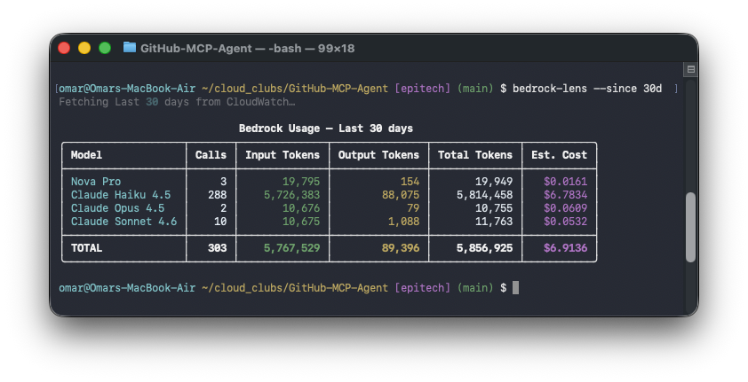

# bedrock-insights

Real-time token usage and cost monitoring for AWS Bedrock, because Cost Explorer won't tell you until tomorrow.



## The problem

When running Bedrock agents, you're flying blind. AWS Cost Explorer has a 24–48 hour lag. CloudWatch has live data, but getting to it requires knowing the log group name, converting dates to epoch milliseconds, parsing deeply nested JSON, and doing the cost math yourself.

There's no `bedrock usage` dashboard. This is that dashboard.

## Install

Install from source:

```bash
git clone https://github.com/superyhee/bedrock-insights.git
cd bedrock-insights
pip install .
```

This puts the `bedrock-insights` command on your PATH. To keep it isolated from
other tools, install it with [pipx](https://pipx.pypa.io) or [uv](https://docs.astral.sh/uv/) instead:

```bash
pipx install .
# or
uv tool install .
```

## First-time setup

Bedrock doesn't log invocations by default. Run the setup wizard once per AWS account:

```bash
bedrock-insights --setup
```

This creates the CloudWatch log group, an IAM role for Bedrock to write to it, and enables model invocation logging. Takes about 10 seconds. After that, every Bedrock call shows up within ~30 seconds. To enable logging in several regions at once, pass `--region us-east-1,us-west-2`.

Control log retention with `--retention`:

```bash
bedrock-insights --setup --retention 90   # expire logs after 90 days
bedrock-insights --setup --retention 0    # remove any existing retention policy
```

If you don't have IAM permissions to create roles, the wizard prints the exact policies and CLI command to hand off to your admin.

## Usage

```bash
bedrock-insights                              # launch the dashboard (major regions)
bedrock-insights --region us-east-1,us-west-2 # monitor specific regions
bedrock-insights --host 0.0.0.0 --port 9000   # change the bind address
bedrock-insights --token "$(openssl rand -hex 16)"  # require a token (see Sharing)
bedrock-insights --profile my-profile         # use a named AWS profile
```

Open the printed URL (default `http://127.0.0.1:8765`) in your browser. The command line only sets launch parameters the UI can't change at runtime (bind address, regions, AWS profile, auth token, persistence). **Everything else — time window, region view, filters, spend threshold, alerts, refresh interval, export — is configured in the dashboard.**

### Options

| Option                         | Purpose                                                                                       |
| ------------------------------ | --------------------------------------------------------------------------------------------- |
| `--region us-east-1,us-west-2` | Region(s) to monitor (default: the major Bedrock regions)                                     |
| `--host` / `--port`            | Bind address (default `127.0.0.1:8765`)                                                       |
| `--token TOKEN`                | Require a token on every route (also `BEDROCK_INSIGHTS_TOKEN`)                                |
| `--no-db`                      | Disable on-disk persistence (in-memory only)                                                  |
| `--no-content`                 | Disable viewing prompt/response bodies in the Recent tab (also `BEDROCK_INSIGHTS_NO_CONTENT`) |
| `--profile`                    | AWS named profile                                                                             |
| `--debug`                      | Print diagnostics (e.g. why a price lookup failed) to stderr                                  |
| `--setup` / `--retention DAYS` | One-time logging setup / log retention                                                        |
| `--version`                    | Print version                                                                                 |

## The dashboard

A dependency-free web UI (Python stdlib server, no front-end build, no CDN) that auto-refreshes and adapts to light/dark themes:

- **Summary cards** — estimated cost, calls, total tokens, average $/call, burn rate, projected $/day, error rate, cache hit rate, and estimated **cache savings** (what prompt-cache reads saved versus full input price). Values count up as they update.
- **Cost-over-time chart** — rounded axis ticks; hover any bucket for exact figures; **click a bucket to drill the whole dashboard into that time range**.
- **Two tabs** — _Overview_ (chart + tables) and _Recent_.
- **Breakdowns** — by model (sortable columns, per-row sparkline), by IAM identity, by region, by error code.
- **Stacked filtering** — click any row to filter; model + IAM identity + region filters apply together and show as removable breadcrumb chips.
- **Recent tab** — the latest invocations; **expand a row to view its request/response bodies**, fetched live from CloudWatch and never stored by the dashboard (disable entirely with `--no-content`).
- **⚙ Settings** (slide-over) — custom rolling window, spend threshold, Slack/webhook alert, and refresh interval at runtime.
- **Share / export** — copy a link that restores the current view (period, region, filters, tab), and download the current view as **JSON / CSV**.
- **Keyboard** — `g` settings · `Esc` close · `r` refresh · `1`/`2` switch tab · `[`/`]` cycle time window.
- **`GET /metrics`** — Prometheus exposition format, ready to scrape into Grafana.
- **`GET /healthz`** — unauthenticated liveness probe (`{"status":"ok"}`) for load balancers / uptime monitors.

## Sharing the dashboard (authentication)

By default the dashboard binds to `127.0.0.1` (localhost) with no authentication. To share it on a network, set a token:

```bash
bedrock-insights --host 0.0.0.0 --token "$(openssl rand -hex 16)"
```

Every route (except the unauthenticated `/healthz` probe) then requires the token, accepted three ways:

- **Browser** — open the URL printed at startup (it includes `?token=…`); the server sets an `HttpOnly` cookie and the token is stripped from the address bar.
- **Scrapers** (`/metrics`) — send `Authorization: Bearer <token>` (Prometheus `bearer_token`) or `?token=<token>`.

> Token auth blocks unauthorized access but traffic is plain HTTP — for real remote use, put it behind a TLS-terminating reverse proxy. The token can also be supplied via the `BEDROCK_INSIGHTS_TOKEN` environment variable.

## Deploy to AWS (hosted dashboard)

To run the dashboard as an always-on hosted service instead of locally, `deploy/cloudformation.yaml` stands the whole thing up in one command — networking, the EC2 instance, Bedrock logging, and a CloudFront front door with TLS.

```bash
aws cloudformation deploy \
  --template-file deploy/cloudformation.yaml \
  --stack-name bedrock-insights \
  --capabilities CAPABILITY_IAM \
  --parameter-overrides AccessToken="$(openssl rand -hex 16)"
```

When it finishes, grab the URL (and remember your token):

```bash
aws cloudformation describe-stacks --stack-name bedrock-insights \
  --query "Stacks[0].Outputs[?OutputKey=='DashboardURL'].OutputValue" --output text
```

Open `https://<dashboard-url>/?token=<your-token>` once — the page stores the token in a cookie and strips it from the URL.

### What it creates

- A VPC with a public subnet, and an **EC2 instance** (Amazon Linux 2023) that installs `bedrock-insights` from this GitHub repo and runs it as a systemd service on port 8765.
- A **CloudFront distribution** in front of it, giving you HTTPS (via the default `*.cloudfront.net` certificate) and acting as the single entry point.
- A security group that admits **only the CloudFront managed prefix list** — the public internet can't reach the instance directly, even though it has a public IP. The dashboard token remains the user-facing gate. A small Lambda-backed custom resource resolves the region-specific prefix list ID at deploy time.
- The **Bedrock invocation log group**, the role Bedrock assumes to write to it, and a Lambda-backed custom resource that enables model invocation logging in the stack's region (there's no native CloudFormation resource for it).
- A **read-only IAM instance role** (just `logs:FilterLogEvents`, `bedrock:List*`, and `pricing:*`) plus SSM Session Manager access for debugging — no SSH port is opened.

### Parameters

| Parameter          | Default                   | Purpose                                                            |
| ------------------ | ------------------------- | ------------------------------------------------------------------ |
| `AccessToken`      | _(required, `NoEcho`)_    | Token required to view the dashboard                               |
| `Regions`          | _(major Bedrock regions)_ | Comma-separated regions to monitor, e.g. `us-east-1,us-west-2`     |
| `InstanceType`     | `t3.small`                | `t3.micro` / `t3.small` / `t3.medium`                              |
| `LogRetentionDays` | `90`                      | CloudWatch retention for the Bedrock log group                     |
| `PollSeconds`      | `60`                      | Poll/refresh interval in seconds (how often CloudWatch is queried) |
| `PriceClass`       | `PriceClass_100`          | CloudFront edge-location coverage                                  |
| `VpcCidr`          | `10.20.0.0/16`            | CIDR for the VPC the stack creates                                 |

> **Notes.** The instance installs from this GitHub repo, so the repository must be **public** (or the `git+https://…` URL in the template's user data needs credentials). Logging is enabled only in the stack's region — deploy a stack per region to monitor others, or run `--setup` there. The token is embedded in EC2 user data and is recoverable via `ec2:DescribeInstanceAttribute`; rotate it if your trusted-operator set changes. Validate the template first with `aws cloudformation validate-template --template-body file://deploy/cloudformation.yaml`. Tear everything down with `aws cloudformation delete-stack --stack-name bedrock-insights` (the log group is retained on purpose so history isn't lost).

### Cost

The hosted stack is deliberately lean — there's **no NAT Gateway** (the instance sits in a public subnet behind the CloudFront prefix list). Rough monthly estimate for a 24/7 deployment in `us-west-2` with defaults:

| Item                                                     | Estimate / month        |
| -------------------------------------------------------- | ----------------------- |
| EC2 `t3.small` on-demand                                 | ~$15                    |
| Public IPv4 address (1)                                  | ~$3.7                   |
| EBS gp3 root volume (8 GB)                               | ~$0.6                   |
| CloudFront (PriceClass_100, light)                       | < $1                    |
| Lambda custom resources, SSM, Pricing/Bedrock list calls | ~$0 (one-off at deploy) |

**Baseline ≈ $20/month**, plus CloudWatch Logs charges that scale with your Bedrock invocation volume (ingestion ~$0.50/GB + storage ~$0.03/GB-month). Those log costs exist whenever Bedrock invocation logging is on — they aren't specific to this dashboard.

The dashboard's polling and the Recent-tab detail lookups use `logs:FilterLogEvents`, which is **not billed per call** (CloudWatch Logs bills ingestion, storage, and Insights queries) — so how often the dashboard polls or how many tabs are open doesn't change the bill (the practical limit is API throttling, not cost).

**To spend less:** deploy with `--parameter-overrides InstanceType=t3.micro` (~$7.6/month) for light monitoring, lower `LogRetentionDays`, apply an EC2 Savings Plan for long-running stacks, or skip the hosted stack entirely and run `bedrock-insights` locally (no EC2 / IP / CloudFront cost — just your existing CloudWatch log charges).

> Prices are approximate and change over time; check the [AWS pricing pages](https://aws.amazon.com/pricing/) for current rates. Content was rephrased for compliance with licensing restrictions.

## Persistence

Per-event data is stored in SQLite at `~/.config/bedrock-insights/facts.db`, so:

- trends survive restarts (no cold start), and
- history outlives CloudWatch's own log retention (kept for 90 days by default).

Storage is hybrid: recent events (the last ~8 days, covering today/yesterday/week) are held in memory for fast aggregation, while longer custom windows are aggregated on demand straight from SQLite. Pricing is recorded at ingest time (point-in-time cost). Pass `--no-db` to run purely in memory.

## How it works

Bedrock writes a JSON record to `/aws/bedrock/model-invocations` in CloudWatch for every model call (model ID, input/output and cache token counts, caller identity, region). `bedrock-insights` reads those records, normalizes model IDs, applies per-region pricing, and serves the dashboard.

A background poller queries each region (concurrently) on an interval (5 s by default; set `BEDROCK_INSIGHTS_POLL_SECONDS`, or `PollSeconds` in the CloudFormation deploy) with a 90-second overlap window — to absorb CloudWatch's ingestion delay — and deduplicates events by ID. It keeps a slim per-event "fact" (token counts and cost — never prompt/response text) so the UI can aggregate any window/region/filter on demand, and caches aggregations so the load on CloudWatch stays constant regardless of how many browser tabs or scrapers are connected.

Prompt/response bodies are **not** part of that fact and are never stored: the Recent tab fetches a single event's bodies live from CloudWatch only when you expand it (a bounded lookup — a narrow time window with a scan cap), and `--no-content` turns that off server-side.

## Pricing

Prices are fetched from two AWS sources at startup and cached to disk for 24 hours at `~/.config/bedrock-insights/pricing_cache.json` (per region):

- **`AmazonBedrockFoundationModels` price list CSV** — Anthropic/Claude (incl. latest releases), Cohere, AI21, and legacy models, with separate regional and Global-profile rates.
- **`AmazonBedrock` Price List API** — Meta (Llama), Mistral, DeepSeek, Amazon Nova, and 50+ more, region-specific.

For a model not yet in either source, the dashboard shows `N/A` for cost; you can record a price once and it's saved to `~/.config/bedrock-insights/overrides.json` (auto-removed once official pricing covers it). Token counts are always accurate regardless of pricing status — they come straight from the Bedrock logs.

## Requirements

- Python 3.9+
- AWS credentials with:
  - `logs:FilterLogEvents` on `/aws/bedrock/model-invocations`
  - `bedrock:ListFoundationModels` and `bedrock:ListInferenceProfiles` for live model discovery
  - `pricing:ListPriceLists` and `pricing:GetPriceListFileUrl` for live pricing
- Bedrock model invocation logging enabled (run `--setup` if not)

## Development

```bash
pip install -e ".[dev]"
ruff check .
pytest
```

### Project layout

```
bedrock_insights/
  cli.py         # Click entry point — launch/bootstrap flags only
  client.py      # boto3 session + per-region CloudWatch clients, region helpers
  cloudwatch.py  # log-group reader: time windows, FilterLogEvents paging, model-id normalization
  pricing.py     # per-region pricing (Bedrock CSV + Price List API), 24h disk cache, overrides
  web.py         # stdlib HTTP server, background poller, aggregation/cache, dashboard HTML, auth, /metrics
  storage.py     # SQLite FactStore (hybrid in-memory + on-disk persistence)
  notify.py      # threshold alerts → Slack/webhook (stdlib urllib)
  display.py     # shared label/formatting helpers
  setup_cmd.py   # one-time --setup wizard (enables Bedrock invocation logging)
deploy/
  cloudformation.yaml   # one-click hosted deploy (EC2 behind CloudFront)
tests/                  # pytest suite
```
